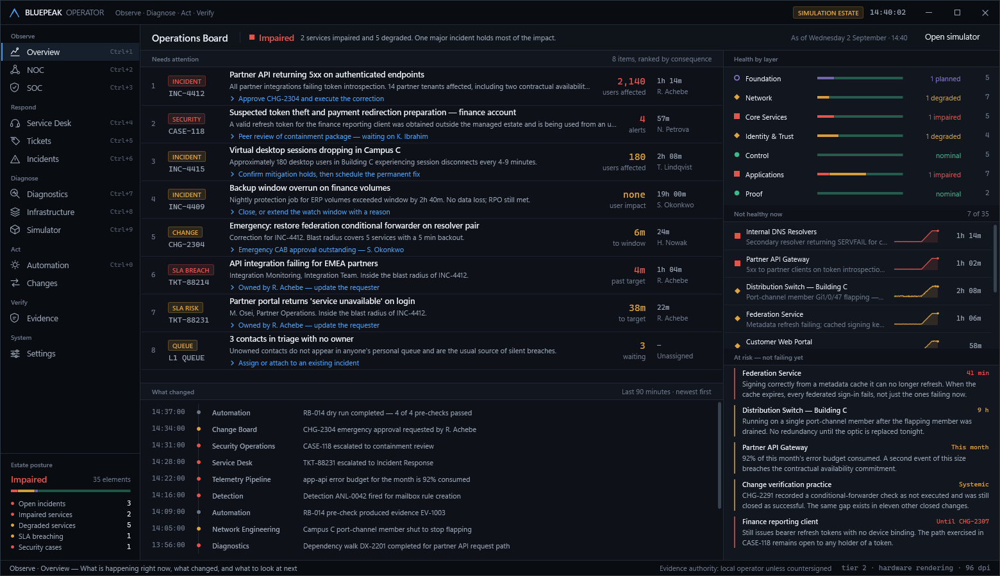
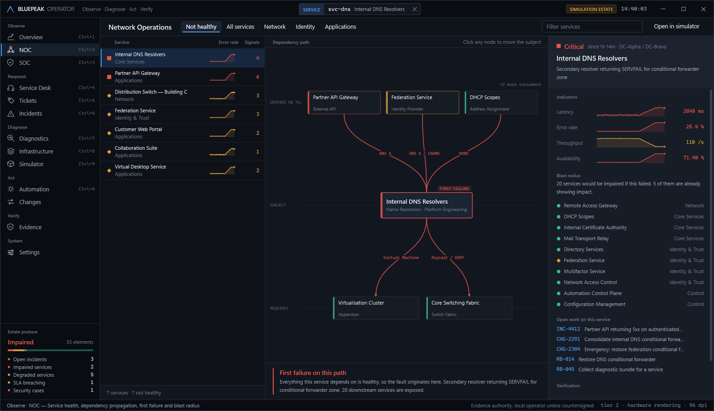
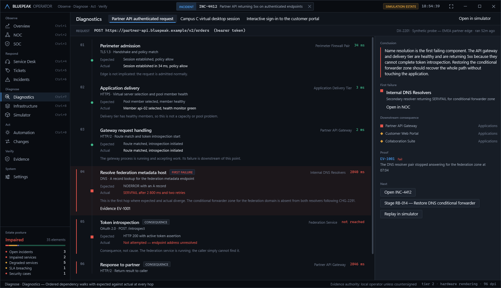
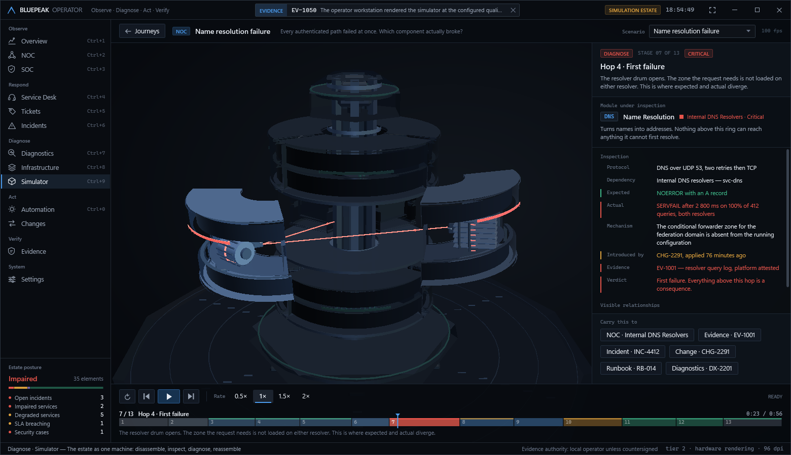
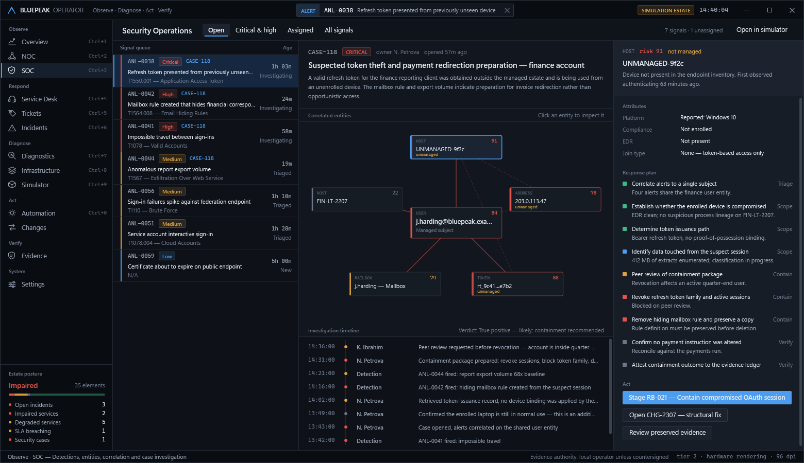
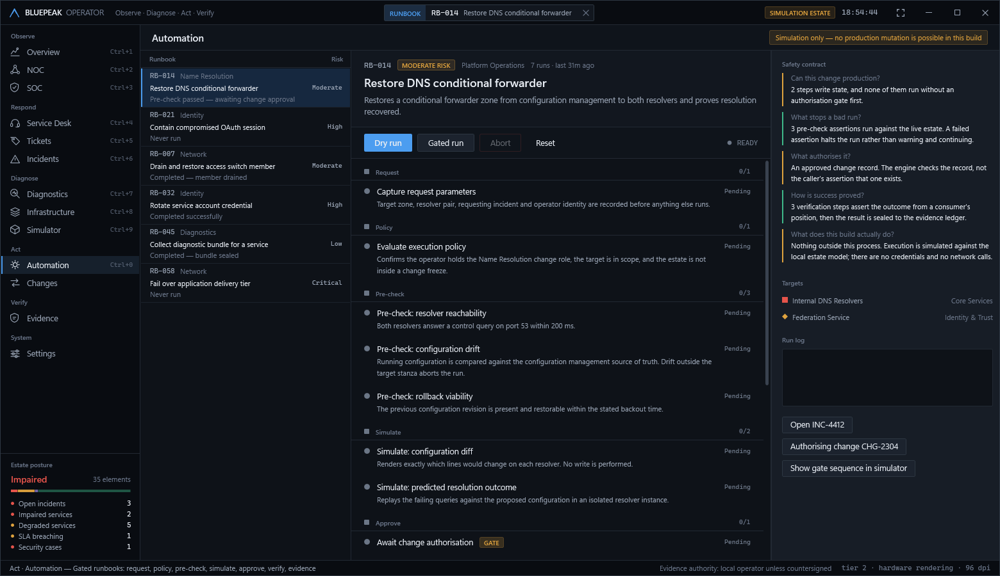

# BluePeak Operator

**Observe. Diagnose. Act. Verify.**

A Windows desktop operations console for enterprise IT. One estate dependency model, thirteen
workspaces, and a real-time 3D simulator that takes the estate apart to show where a request
actually broke.

C# · .NET 10 · WPF. No web view, no embedded browser, no imported 3D assets — every surface is
WPF and every piece of geometry in the simulator is generated in code.



---

## The problem it is built around

Most operations tools answer *what is red*. That is the easy half. The expensive question is:

> **Is this fault mine, or did I inherit it?**

An API gateway returning 5xx looks like an API problem. Restart it, fail it over, page the
application team — and none of it helps, because the gateway is healthy and cannot resolve the
address of the service it needs. Every minute spent on the symptom is a minute the actual cause
runs unattended.

That question shapes the whole product:

- **The estate is one dependency graph.** Every workspace is a view onto it, not a separate dataset.
- **Context is carried.** A subject selected anywhere is selected everywhere. Pick an incident on
  the board and it is already selected in NOC, Diagnostics, Changes and Evidence when you arrive.
- **Diagnosis is an ordered walk** with expected against actual at every hop. The first hop where
  they diverge is the cause. Everything above it is labelled *consequence*, so you do not act on it.
- **Automation is gated.** The engine's job is to refuse. Policy, pre-check, simulation and an
  authorisation record must all clear before anything is permitted to write.
- **Evidence states its own authority.** A record produced on this workstation carries *local
  operator* authority, and the product will not let that quietly become a project position.

## The estate model

`EstateModel` holds 35 managed elements across seven architectural layers and 58 modelled
dependency edges, plus the operational records that hang off them — tickets, incidents, alerts,
security cases, entities, changes, runbooks, evidence and diagnostic paths. Adjacency is indexed
once at load.

Three graph operations carry most of the product's reasoning:

| Operation | Answers |
|---|---|
| `DependenciesOf` / `DependentsOf` | What does this need; what needs this |
| `BlastRadius(id)` | Transitive closure over consumers — what breaks if this fails |
| `FirstFailure(id)` | Deepest unhealthy element on this node's own dependency path |

`FirstFailure` is the one that changes behaviour. When a service is unhealthy it walks *down*
through what that service requires and returns the deepest unhealthy element found. If that is the
node itself, the fault originates there. If it is something below, the node is a victim — and NOC
says so in as many words, because the difference decides whether you act here or somewhere else.



## How diagnosis works

A dependency walk is an ordered list of hops. Each hop records the protocol, the operation, what
was **expected**, what was **actually** observed, the elapsed time, and a short piece of reasoning
about what that hop rules in or out.

The walk names exactly one first failure — the first hop where expected and actual diverge — and
marks everything after it as downstream consequence. A hop that is *degraded but still answering*
is allowed to appear **before** the first failure: that is the masked-fault case, where a component
is impaired yet succeeding from cache, so it is not where the request broke. This distinction is
asserted by test, not left to authoring discipline.



## The simulator

The estate is rendered as one engineered machine — the **BluePeak Operations Core**. A hexagonal
spine carries an emissive bus and four stacked decks of chassis wedges on a datum-marked platform.
Each wedge is a functional subsystem, and each docks to the spine through a visible connector.

```
        ┌─────────────┐
        │  EVD  crown │   Evidence Vault                        ring 4
        └─────────────┘
   ┌────┬─────────────┬────┐
   │CTL │     SOC     │AUT │   Control · Inspection · Automation ring 3
   └────┴─────────────┴────┘
   ┌────┬─────────────┬────┐
   │APP │     DNS     │IDT │   Workload · Resolution · Identity  ring 2
   └────┴─────────────┴────┘
   ┌────┬─────────────┬────┐
   │IGR │     SWF     │RTG │   Ingress · Switching · Routing     ring 1
   └────┴─────────────┴────┘
   ╔═══════════════════════╗
   ║   FND  foundation     ║   Foundation Platform               ring 0
   ╚═══════════════════════╝
```

### Mechanical disassembly and reassembly

Every wedge is a **clamshell**: an outer skin band, top and bottom decks, and end walls enclosing a
hollow bay. When a journey reaches a module, the retaining collar releases, the wedge translates
out along its radial axis, rotates to present its face, and the clamshell halves separate
vertically and flare outward — exposing a mechanism whose form is specific to what that subsystem
does.

| Module | Mechanism | Why that form |
|---|---|---|
| Request Ingress | Fan of connector blades behind a slotted faceplate | Requests arrive as discrete channels |
| Switching Fabric | Crossbar lattice with two separate bundle members | A failing *member* must be visible, not just the bundle |
| Routing and Delivery | Faceted prism with directional vanes | A path is chosen from alternatives |
| Name Resolution | Indexed drum with radial fins on bearings | Zones are entries on a rotating index |
| Identity and Trust | Sealed cylinder behind a keyed collar | Signing material is locked; the collar unlocks under inspection |
| Application Workload | Stacked service plates on spacer posts | Instances behind one address |
| Observation and Control | Sensor dome on a gimbal ring | It watches the rings beneath it and sweeps |
| Security Inspection | Concentric aperture rings and a six-blade iris | It closes in on what it is examining |
| Gated Automation | Cylinder, piston and guide rails with gate indicators | It only travels once the gates clear |
| Evidence Vault | Sealed block over a stack of ledger plates | Records are added, never rewritten |
| Foundation Platform | Hexagonal plinth with six feet and a datum ring | Everything stands on it |

At the end of a journey the sequence reverses: parts return along their extraction axes, seat
against the spine, and lock.



Six journeys ship, each with its own dependency story and choreography — they are not one animation
with different captions:

| Journey | Discipline | The question |
|---|---|---|
| Service desk contact | Service Desk | Is this a new fault, or one we already own? |
| Name resolution failure | NOC | Every authenticated path failed at once. Which component actually broke? |
| Authentication and trust | Identity | Sign-in works for some people and not others. How long have we got? |
| Network path failure | NOC | Sessions drop every few minutes. Throughput looks fine. What is wrong? |
| Security detection and response | SOC | Four alerts on one account. One intruder, or four coincidences? |
| Gated automation run | Automation | Can I safely change this, and how will I know it worked? |

### Timeline architecture

The design decision the simulator rests on:

> **Scene state is a pure function of playhead position.**

```csharp
SceneSnapshot Evaluate(double time)
```

A journey is a list of stages, each declaring a camera pose, a set of module poses, the visible
links and the inspection detail. `JourneyTimeline` resolves every stage to a *complete* pose set at
construction, then evaluation interpolates between stage `i-1` and stage `i` with an easing curve.

Nothing about the result depends on how the playhead arrived at that instant. That single property
gives, for free:

- **Scrubbing backwards** reconstructs the exact earlier state — there is no accumulated state to unwind
- **Scrubbing forwards** reconstructs the exact later state — no fast-forward simulation required
- **Resume after a scrub** continues correctly, and only resumes playing if it was playing before the drag
- **Random access** — dragging the playhead anywhere is as valid as playing to that point
- **Lifecycle recovery** — detaching and re-attaching the render loop re-derives the frame from the
  controller, so navigating away and back cannot lose or corrupt playback

All of this is asserted directly: the engine tests evaluate every timeline forward, in reverse and
in shuffled random access, and require identical poses.

The scrub bar is the real timeline — segments sized to actual stage durations, coloured by stage
kind, with a verdict tick in the stage's outcome colour. Transport is play, pause, resume, replay,
step, rate (0.5× / 1× / 1.5× / 2×), scenario change and back.

## Workspaces

Navigation is grouped by the operator loop rather than by product module, because that is the order
the questions arrive in.

**Observe** — Overview, NOC, SOC · **Respond** — Service Desk, Tickets, Incidents ·
**Diagnose** — Diagnostics, Infrastructure, Simulator · **Act** — Automation, Changes ·
**Verify** — Evidence

| Workspace | The question it answers |
|---|---|
| Overview | What needs attention, ranked by consequence, with the next action attached |
| NOC | Is this fault mine or inherited, and what is exposed if it gets worse |
| SOC | Are these separate alerts, or one actor on one subject |
| Service Desk | Does this contact already have a cause somebody else owns |
| Tickets | Where is the SLA position and what is this contact linked to |
| Incidents | What is the impact, the cause, and the correction in flight |
| Diagnostics | Where exactly did expected and actual diverge |
| Infrastructure | What breaks if this fails, and what is it degraded by |
| Simulator | Show me the machine and take it apart along the failing path |
| Automation | Can this be run safely, and what will stop it if not |
| Changes | What are the consequences before I approve this |
| Evidence | What was claimed, what was checked, and who may assert it |
| Settings | What this build is permitted to do |

<table>
<tr>
<td width="50%"></td>
<td width="50%"></td>
</tr>
<tr>
<td align="center"><em>SOC — four detections correlated onto one subject</em></td>
<td align="center"><em>Automation — the gate stack that must clear before a write</em></td>
</tr>
</table>

## Safety boundaries

This build **observes and simulates**. Stated plainly, and enforced rather than promised:

- No credential store, no configured endpoint, no network client is compiled in.
- Every action described as an execution runs against the in-memory estate model in this process.
- Triage decisions, recorded approvals and runbook runs are session-local and are discarded on exit.
- Evidence carries one of three authorities — *local operator*, *platform attested*, or *project
  authoritative*. The Evidence workspace shows which applies to every record and does not allow the
  distinction to be edited away.
- The estate is a deterministic fixture built from a fixed seed, so every launch shows the same
  situation and captures are reproducible. Names, people and addresses are fictional; addresses come
  from documentation ranges reserved for examples.

The gates in the automation engine are real regardless: a runbook that will not run without policy,
pre-check, simulation and an authorisation record behaves identically whether the target is live or
modelled, and that behaviour is the thing being demonstrated.

Full statement in [docs/KNOWN-LIMITATIONS.md](docs/KNOWN-LIMITATIONS.md) and on the Settings workspace.

## Architecture

```
src/BluePeak.Domain        net10.0           Estate model, entities, graph analysis, seed fixture
src/BluePeak.Simulation    net10.0           Scene model, journeys, timeline, playback, runbook engine
src/BluePeak.App           net10.0-windows   WPF: design system, controls, workspaces, 3D renderer
tests/BluePeak.Tests       net10.0           Domain and simulation engine
tests/BluePeak.UiTests     net10.0-windows   Views, navigation, 3D lifecycle
```

The dependency direction is strict and one-way: `App → Simulation → Domain`. Neither lower layer
references WPF, which is what makes the timeline, scene evaluation and runbook engine testable
without a UI thread.

3D rendering follows the WPF performance guidance closely: a single `Viewport3D` with hit-testing
and `ClipToBounds` disabled, all geometry built once and frozen, links pooled and positioned by
transform rather than rebuilt, and dimming done by **value** rather than alpha so transparency
sorting never enters the picture. Per frame the renderer writes transforms and brush colours only.

See [docs/ARCHITECTURE.md](docs/ARCHITECTURE.md) for detail, including the horizontal-field-of-view
correction that the design review caught.

## Testing

**124 tests — 96 engine, 28 user interface and lifecycle.**

Coverage includes: all six journeys structurally validated; timeline evaluation identical forward,
reverse and random-access; no part moving more than a threshold between adjacent 60 fps frames;
scrub, resume-after-scrub and replay; a stalled render loop unable to skip the timeline; the
dependency graph proven acyclic; every cross-reference between records resolving; the runbook
engine's approval gate proven to precede every mutating step; every workspace constructed and laid
out at three window sizes; no Grid's columns exceeding its container; twelve simulator activation
cycles without stacking render subscriptions; and the playhead preserved exactly across navigation.

Packaged startup is verified by *launching each package* and requiring it to render all seventeen
surfaces — not by checking that a file exists.

Full breakdown in [docs/TESTING.md](docs/TESTING.md).

## Running it

### From a package

| Package | Requires | Size |
|---|---|---|
| `BluePeak-Operator-Windows-x64.zip` | nothing — runtime included | ~59 MB |
| `BluePeak-Operator-Windows-x64-FrameworkDependent.zip` | .NET 10 Desktop Runtime | ~0.3 MB |

Download, extract, run **`BluePeak.Operator.exe`**. No installer, no configuration, no first-run
setup, and nothing written outside the folder you run it from.

Minimum window size is 1380 × 760.

### From source

```bash
dotnet run --project src/BluePeak.App/BluePeak.App.csproj -c Release
```

### Build and test

```bash
pwsh scripts/build.ps1                  # Release with warnings-as-errors, both test suites
pwsh scripts/build.ps1 -Package         # also produce both Windows packages
pwsh scripts/build.ps1 -Capture         # also regenerate docs/captures
```

### Package

```bash
pwsh scripts/package.ps1                # build all three archives into dist/, then verify them
```

`package.ps1` verifies what it produces: both Windows archives are extracted to fresh directories
and **launched from the extracted copy**, and the source archive is extracted, restored, built with
warnings-as-errors and run through both test suites from clean. It also writes `dist/SHA256SUMS.txt`.

### Keyboard

| Key | Goes to |
|---|---|
| `Ctrl+1` … `Ctrl+9`, `Ctrl+0` | Overview, NOC, SOC, Service Desk, Tickets, Incidents, Diagnostics, Infrastructure, Simulator, Automation |

In the simulator: `Space` play/pause · `,` `.` previous/next stage · `R` replay · `Esc` back ·
`←` `→` scrub (with `Shift` for five seconds). The timeline is draggable anywhere along its length.

## Documentation

- [Architecture](docs/ARCHITECTURE.md) — layers, the timeline model, 3D rendering decisions
- [Design system](docs/DESIGN-SYSTEM.md) — tokens, composition rules, what is deliberately absent
- [Simulator](docs/SIMULATOR.md) — the machine, the journeys, the motion language
- [Testing](docs/TESTING.md) — what is covered and the evidence
- [Known limitations](docs/KNOWN-LIMITATIONS.md) — what this build does not do

`docs/captures/` holds a rendered capture of all thirteen workspaces plus four points along a
simulator journey, regenerated by `scripts/build.ps1 -Capture`. The design review was done against
those pixels rather than against XAML.
